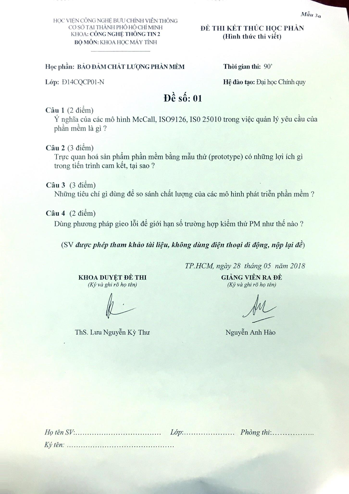

<h1 align="center">Đảm bảo chất lượng phần mềm 
    Môn học "khó nhất" bạn sẽ học ở năm cuối đại học do thầy Nguyễn Anh Hào giảng dạy
</h1>

    

# [**Table Of Content**](#table-of-content)
- [**Table Of Content**](#table-of-content)
- [**Introduction**](#introduction)
- [**Overview**](#overview)
  - [**Mid-semester Exam**](#mid-semester-exam)
  - [**Final Exam**](#final-exam)
- [**Document**](#document)
- [**Post Script**](#post-script)
- [**Made with 💘 and Vietnamese**](#made-with--and-vietnamese)

# [**Introduction**](#introduction)

Lời đầu tiên, Phong muốn giành lời cảm ơn tới tất cả các bạn đang đọc những dòng lưu bút này ♥♥♥. Đây sẽ là tài liệu cuối cùng Phong có thể xây dựng và 
đóng góp cho các bạn sinh viên PTIT với ý nghĩa là tài liệu tham khảo môn học trên trường. 

Sẽ không còn bất cứ tài liệu môn học nào Phong có thể ghi chép và chia sẻ tới các bạn về các môn học các bạn sẽ gặp ở trên trường nữa. Cũng có thể tài liệu này 
cũng sẽ không còn giá trị nếu tương lai môn học này bị thay thế bởi môn học khác hoặc chương trình học của các bạn sẽ khác so với những gì Phong sắp viết dưới đây🤗🤗.

Nhưng Phong rất vui vì mình đã đóng góp được điều gì đó có ý nghĩa cho các bạn sinh viên đang và sẽ dành 4.5 năm cuộc đời mình để gắn bó dưới mái trường PTIT này.
Hi vọng những điều này Phong làm ngày hôm nay sẽ có giá trị mãi mãi sau này.

Wir haben sie 😎

# [**Overview**](#overview)

Câu đầu tiên và quan trọng nhất nè. `Môn này không phải làm đồ án, cuối kì thi tự luận`

Thi giữa kì và cuối kì: thi giấy

Chuyên cần: 10%

Giữa kì: 20%

Cuối kì: 70% - không được mở tài liệu

Môn này chiếm 3 tín chỉ -> học 11 buổi tất cả.

Học từ 28-12-2021 đến ngày 03-04-2021 - đó là đổi với mình nha 😋

Các bạn có để tiêu đề hem ? `Môn học "khó nhất"` bạn sẽ học ở năm cuối đại học do thầy Nguyễn Anh Hào giảng dạy. 

Vậy nó khó ở chỗ nào ? 

Môn này khó ở chỗ là một môn học lý thuyết 100% và không có bất kì bài tập hay phải làm tính toán gì cả. Điểm khó ở chỗ là
người dạy môn học này là thầy Nguyễn Anh Hào. Thầy Hào có ưu điểm là thầy sẽ giảng bất kể là sinh viên có đang lắng nghe hay làm việc riêng hay là không ?(Không biết có phải ưu điểm không nữa🤣🤣). 

Điểm làm môn học này đáng sợ là thầy Hào giảng `cực kì cực kì buồn ngủ 🥱😴`, buồn ngủ tới nỗi mà khi bạn học Đường lối Đảng Cộng Sản bạn sẽ thấy môn đó học còn khỏe hơn môn này gấp mấy lần.

Nên một tiết học dài 4 tiết sẽ dài hơn bạn cảm nhận rất nhiều. Tiếp theo là nội dung thầy truyền đạt rất là lan man, dài dòng và không có bất kì trọng tâm gì cả. 

Mình đã cố gắng chăm chú lắng nghe để ghi chép nhưng mình đã thất bại lun rồi 😓😒.

Nhưng kiến thức môn này thì không thể coi thường được ! Nó quan trọng nên mới tới năm cuối các bạn mới học là vì vậy. Đây cũng là môn học tiên quyết theo trường trình học của chúng mình mà.

Khi Phong đi thực tập tại doanh nghiệp, rất nhiều kiến thức của môn này được ứng dụng vào vị trí QA hay Quanlity Assurance, tức là đảm bảo chất lượng phần mềm. Văn vở hơn chúng ta gọi là chuyên viên kiểm thử phần mềm. Còn nếu dịch thô ra thì nó là làm tester ấy.
Nên bạn nào có hướng làm QA hoặc cả BA thì nên cố gắng học môn này để sau này ra làm các vị trí này nha.

Gửi lời cảm ơn tới COVID-19 🦇, nhờ có COVID, chúng ta đã lưu lại được không ít bài giảng của các môn học trên trường. Và dĩ nhiên môn Đảm bảo chất lượng phần mềm cũng vậy.
Vào [**đây**](https://www.youtube.com/playlist?list=PLVSnPY-3GfCatUyT-jIUQNgNwp8rX8LB1) để xem những bài giảng đã được thu lại nè. Tuy cũng không đầy đủ từ đầu tới cuối nhưng có còn hơn không mà 🤣🤣🤣.

Lòng vòng quá rùi, vào xem thi cuối kì với giữa kì như nào nhé.

## [**Mid-semester Exam**](#mid-semester-exam)

Thi giữa kì có thể nói là khá dễ thở. Nếu cả lớp học chú ý một chút thì thầy sẽ thương tình tiết lộ nội dung kiểm tra. Nói là tiết lộ cho oai thui 😝 chứ các bạn cũng phải học đủ 3-4 chương tùy vào 
tốc độ học để làm. Nếu lớp ý thức kém thì thầy sẽ méo nói gì đâu, các bạn sẽ chỉ được báo là `tuần sau sẽ có bài kiểm tra 15 phút nha các em`.

Còn nội dung thi thì ngắn gọn lém. Có 1 câu duy nhất thôi à. Câu này sẽ xuất phát từ nội dung của 1 chương bạn đã học trong chương trình. 

Lúc mình viết những dòng này, 10-07-2022, mình cũng không nhớ chưa thực sự về từng câu chữ nhưng nó sẽ như này 

Lớp mình học: 
> Có mấy loại môi trường của phần mềm ? Cần làm gì để hiểu đúng yêu cầu của phần mềm ?

Lớp còn lại:
> Môi trường vận hành là gì ? Vì sao việc lấy ý kiến từ môi trường vận hành rất quan trọng ?

Cả lớp sẽ được làm trong vòng 1 tiếng và được mở tài liệu thả cửa.

Thầy cũng tạo điều kiện cho bạn nào bị vắng thi hôm kiểm tra thì sẽ được làm bù vào một ngày khác.

## [**Final Exam**](#final-exam)

Bài thi cuối kì môn học này sẽ đánh dấu sự trưởng thành của mọi sinh viên khoa công nghệ thông tin. Đây sẽ là bài kiểm tra giấy cuối cùng nói riêng và là bài thi cuối cùng nói chung tại PTIT với vai trò là sinh viên của trường.

> Note: tầm này các bạn học kinh tế chắc ra trường đến nơi rồi ấy vì có 4 năm thui mà.

Bài thi này có thể nói là khó vì mình tìm nát cả google cũng chỉ tìm được 1 đề có thể tham khảo được từ khóa D14 lận. 
D17 thì thi vấn đáp do COVID-19 nên không có.

Các bạn chắc chắc sẽ `không được sử dụng tài liệu`. Ban đầu, mình tự tin rằng do là sinh viên năm cuối nên các thầy cô sẽ châm trước cho sử dụng tài liệu cơ😅😅. Nhưng mà sự thật luôn phũ phàng,
2 ông thầy coi thi phòng mình coi thi gắt vkl luôn ạ 🙂 🙂. Có đứa dùng tài liệu bị phát hiện còn bị lập biên bản luôn cơ ạ.

Nói chung là đừng nghĩ tới việc mở được tài liệu luôn cho khỏe(chắc thầy Hào dặn coi phải gắt 🙄🙄)

    

<h3 align="center">

***Đề thi chính thức khóa D14***
</h3>

    

<h3 align="center">

***Đề thi chính thức khóa của mình, tức D18***
</h3>

# [**Document**](#document)

Trong repository này các bạn sẽ có 

1. Slide bài giảng 

2. Một số ghi chép của mình 

3. Hai đề thi phía trên dạng ảnh PNG | JPG

# [**Post Script**](#post-script)

- **10:41 PM Chủ nhật, 10-07-2022**

Hành trình của mình dưới mái trường PTIT đã gần tới hồi kết rùi 😔. Trước mắt mình chỉ còn đồ án thực tập và đồ án tốt nghiệp nữa là hoàn thành chặng đường này.

Chắc chắn mình sẽ cập nhật ở trong 2 repository khác về quy trình làm đồ án thực tập & tốt nghiệp.

Chúc các bạn đang đọc những dòng lưu bút này gặp nhiều may mắn và thành công trong công việc. Cảm ơn bạn vì đã ở đây.

# [**Made with 💘 and Vietnamese**](#)